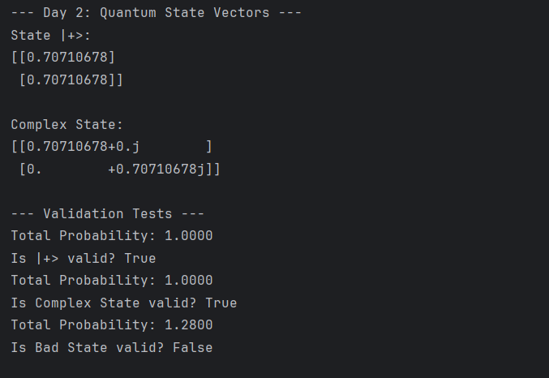

# Day 1: Classical Information & Linear Algebra

**Goal:** Understand the mathematical bridge between Classical and Quantum machines.

---

## 1. The Key Realization
> "Quantum machines are just classical machines with advanced math and probability."

I learned that before we touch qubits, we must master probability vectors. A **"State"** is just a column vector where values sum to 1.

## 2. Dirac Notation (My Cheat Sheet)

* **Ket ($|\psi\rangle$):** A Column Vector (The State).
    $$
    |0\rangle = \begin{pmatrix}1\\0\end{pmatrix}
    $$
* **Bra ($\langle\psi|$):** A Row Vector (The Transpose).
* **Measurement:** "Collapsing" the vector into a single defined state.

## 3. Building Operations
I implemented a **Deterministic Operation (NOT Gate)** using pure Linear Algebra.

* **Formula:**
    $$
    M = |1\rangle\langle0| + |0\rangle\langle1|
    $$

This proves that logic gates are just matrices that swap numbers in vectors.

## 4. Code Snippet
I wrote a python script `classical_simulation.py` to prove that matrix multiplication simulates logic gates.

---
#### **📅 Day 2: Quantum State Vectors & Superposition**
**Goal:** Understand how Qubits differ from Classical Bits using Complex Vectors.

**1. The Quantum State Vector ($|\psi\rangle$)**
Unlike a classical probability vector where entries are real numbers summing to 1, a Quantum State Vector uses **Complex Numbers** (Amplitudes).
* **Symbol:** $\psi$ (Psi).
* **Format:** Column vector $\begin{pmatrix} \alpha \\ \beta \end{pmatrix}$.

**2. The Golden Rule: Normalization**
For a state to be valid, the sum of the **squared magnitudes** of its amplitudes must equal 1.
$$|\alpha|^2 + |\beta|^2 = 1$$
* $\alpha$ is the "amplitude" of state $|0\rangle$.
* $|\alpha|^2$ is the **probability** of measuring $|0\rangle$.

**3. Superposition**
A qubit is not "both 0 and 1" in the classical sense. It is a linear combination of the basis vectors:
$$|\psi\rangle = \alpha|0\rangle + \beta|1\rangle$$
* **Example:** The $|+\rangle$ state (created by Hadamard gate):
    $$|+\rangle = \frac{1}{\sqrt{2}}|0\rangle + \frac{1}{\sqrt{2}}|1\rangle$$
    *(Probabilities: $(\frac{1}{\sqrt{2}})^2 = 0.5$ for both 0 and 1).*

**4. Code Experiment**
I wrote a script to check if a vector is a valid quantum state by calculating its Euclidean norm.
