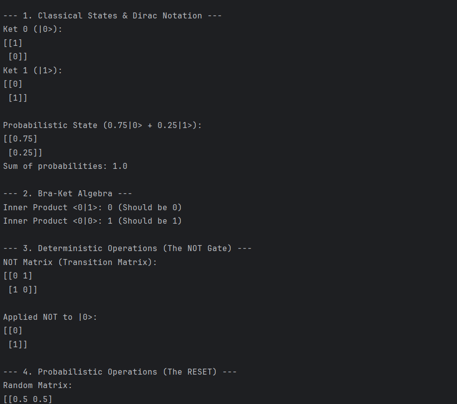
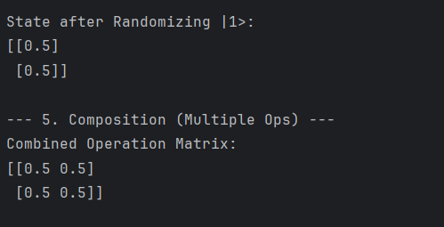

# Day 1: Classical Information & Linear Algebra

**Goal:** Understand the mathematical bridge between Classical and Quantum machines.

---

## 1. The Key Realization
> "Quantum machines are just classical machines with advanced math and probability."

I learned that before we touch qubits, we must master probability vectors. A **"State"** is just a column vector where values sum to 1.

## 2. Dirac Notation (My Cheat Sheet)

* **Ket ($|\psi\rangle$):** A Column Vector (The State).
    $$
    |0\rangle = \begin{pmatrix}1\\0\end{pmatrix}
    $$
* **Bra ($\langle\psi|$):** A Row Vector (The Transpose).
* **Measurement:** "Collapsing" the vector into a single defined state.

## 3. Building Operations
I implemented a **Deterministic Operation (NOT Gate)** using pure Linear Algebra.

* **Formula:**
    $$
    M = |1\rangle\langle0| + |0\rangle\langle1|
    $$

This proves that logic gates are just matrices that swap numbers in vectors.

## 4. Code Snippet
I wrote a python script `classical_simulation.py` to prove that matrix multiplication simulates logic gates.

